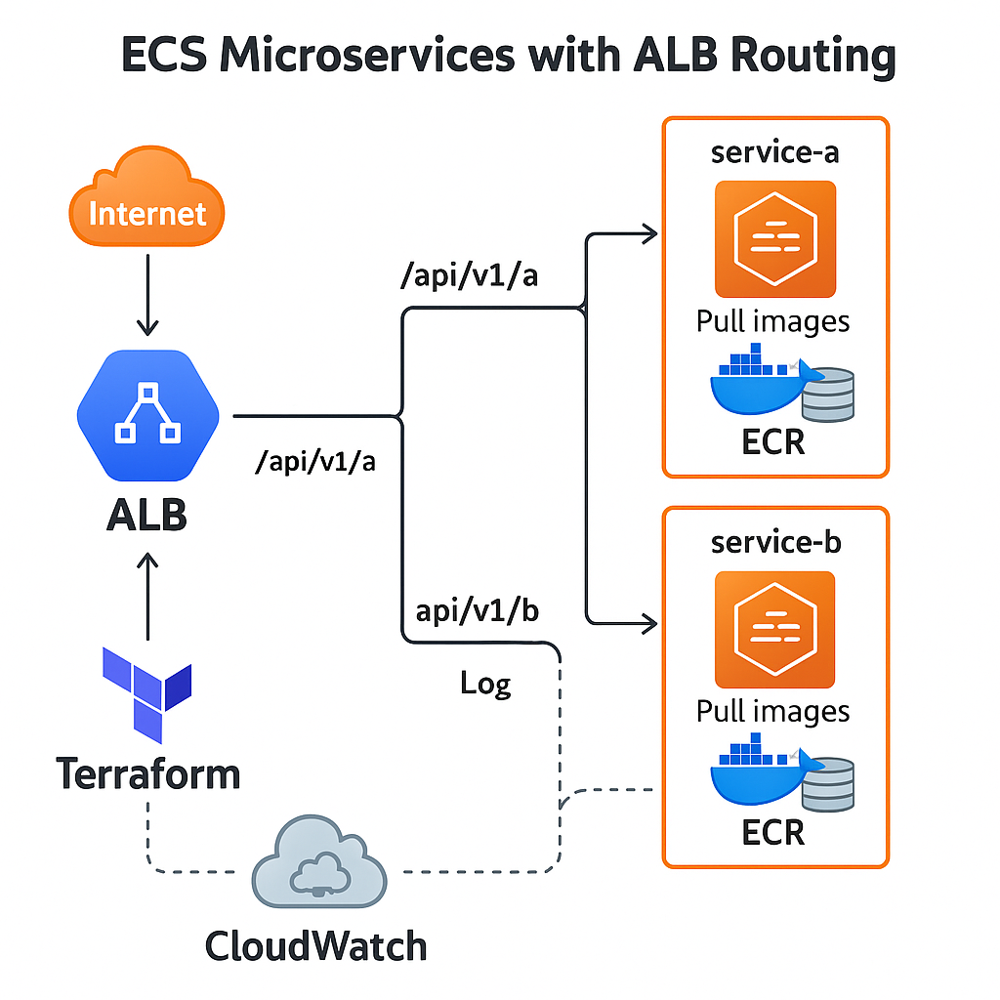

<h1 align="center" style="font-family: 'Segoe UI', sans-serif; font-size: 48px; color: #4CAF50;">
  🚀 ECS Microservices with Load Balancer  
</h1>

<p align="center">
  
  
  
  <br><br>
  <strong>Production-ready microservices deployed on ECS Fargate with ALB, Terraform, and CloudWatch 🚀</strong>
</p>

---

## 🧠 Project Overview

 This project demonstrates deploying **two scalable microservices** on **AWS ECS (Fargate)** with routing through an **Application Load Balancer**. It also includes **autoscaling**, **monitoring**, and **modular Terraform code** to automate infrastructure provisioning.

---

## 👨‍💻 Author

<div align="center" style="margin-top: 2rem; margin-bottom: 2rem; animation: fadeInUp 2s ease-in-out;">
  
  <h3 style="color:#1d4ed8; font-weight:700; font-size:1.75rem; margin-top: 0.5rem; animation: zoomIn 1s ease-in-out;">Jotheeshwaran V</h3>
  <p style="color:#6b7280; font-size:1.05rem;">
    📧 <strong>Email:</strong> <a href="mailto:jotheeshwaranv2002@gmail.com">jotheeshwaranv2002@gmail.com</a><br/>
    🌐 <strong>Portfolio:</strong> <a href="https://unique-crepe-5ea0e0.netlify.app" target="_blank">unique-crepe-5ea0e0.netlify.app</a><br/>
    🔗 <strong>LinkedIn:</strong> <a href="https://linkedin.com/in/jotheeshwaran-v" target="_blank">linkedin.com/in/jotheeshwaran-v</a>
  </p>
</div>

---


## 🛠️ Tech Stack

| 🔧 Category         | ⚙️ Tools Used                            |
|--------------------|-------------------------------------------|
| Cloud Provider     |  |
| Container Runtime  | Docker 🐳                                 |
| Orchestration      | ECS (Fargate) 🧬                          |
| Load Balancer      | Application Load Balancer 🔀             |
| IaC Tool           | Terraform 🛠️                             |
| Monitoring         | CloudWatch 📊                            |
| Repository         | GitHub 🐙                                 |

---

## 🧱 High-Level Architecture
<div align="center" style="margin-top: 2rem; margin-bottom: 2rem; animation: fadeInUp 2s ease-in-out;">
  
</div>

---

## 📁 Folder Structure

```
ecs-microservices-alb/
├── terraform/ # Terraform infrastructure code
│ ├── main.tf
│ ├── variables.tf
│ └── outputs.tf
├── service-a/ # Microservice A (Dockerized)
│ └── Dockerfile
├── service-b/ # Microservice B (Dockerized)
│ └── Dockerfile
├── screenshots/ # Screenshots of deployment
└── README.md # This file 📘

```
---

## 🚀 Quick Start

Prerequisites: AWS CLI configured, Terraform installed, Docker installed.


# Step 1: Clone this repository
```bash
git clone https://github.com/Jotheesh2002/ecs-microservices-alb.git
cd ecs-microservices-alb/terraform
```
# Step 2: Initialize Terraform
```bash
terraform init
```
# Step 3: Preview infrastructure changes
```bash
terraform plan
```
# Step 4: Apply the infrastructure
```bash
terraform apply
```
# Step 5: Destroy (when no longer needed)
```bash
terraform destroy
```
✅ Features
✅ 2 Microservices deployed using Docker

✅ ECS Fargate Task definitions with autoscaling

✅ ALB with path-based routing (/api/v1/a, /api/v1/b)

✅ CloudWatch integration for logging & monitoring

✅ 100% Infrastructure as Code via Terraform

✅ Clean modular folder structure

## 💡 Future Enhancements
🔁 Add CI/CD using GitHub Actions or Terraform Cloud

🔒 Add IAM role-based permissions

🌍 Add Route 53 for custom domains

🧪 Include test automation framework

## 🙋‍♂️ Author
👨‍💻 Jotheeshwaran V
📍 Chennai, India
📬 GitHub • LinkedIn • ✉️ jotheeshwaran2002@gmail.com

⚖️ License
This project is licensed under the MIT License. Feel free to use, fork, and contribute!

